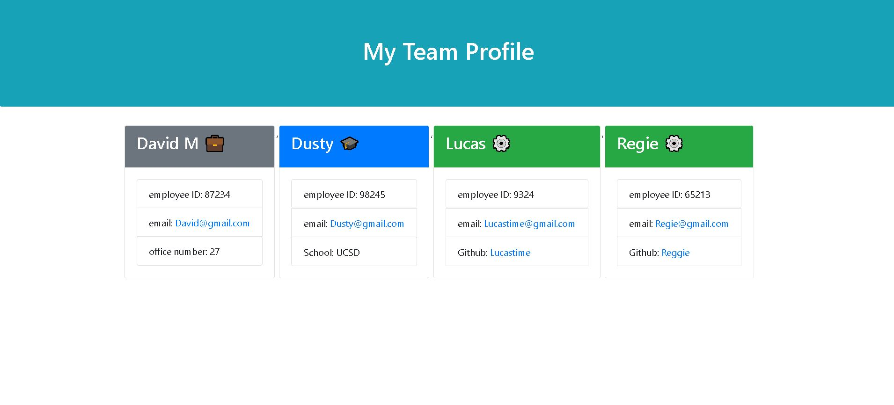

# Team Profile Generator

## Description

This Team Profile Generator application allows the user to input data about employees on a software engineering team and creates an organized HTML page that displays all of their information. 

## Installation

This app uses Jest for running unit tests and Inquirer for collecting user input. To install these programs, use the following commands in the terminal:

```bash
npm i
npm i jest
```
The following packages also need to be included in the index.js file to run the app:

```
const inquirer = require("inquirer")
const fs = require('fs');
```

The application will then be invoked by using the following command:

```bash
node index.js
```
## Usage

The application organizes the employees based on their position on the team: manager, intern, or engineer. The generated cards are color coded for easy visualization of the team's diversity.

The following image shows an example of the generated HTML’s appearance and functionality:



## Walkthrough Video

Follow this link to see this application's functionality and an example of a generated team profile:

https://drive.google.com/file/d/1ZlqhotX_xbplFiwa78Odp3k-FLizXRE5/view

